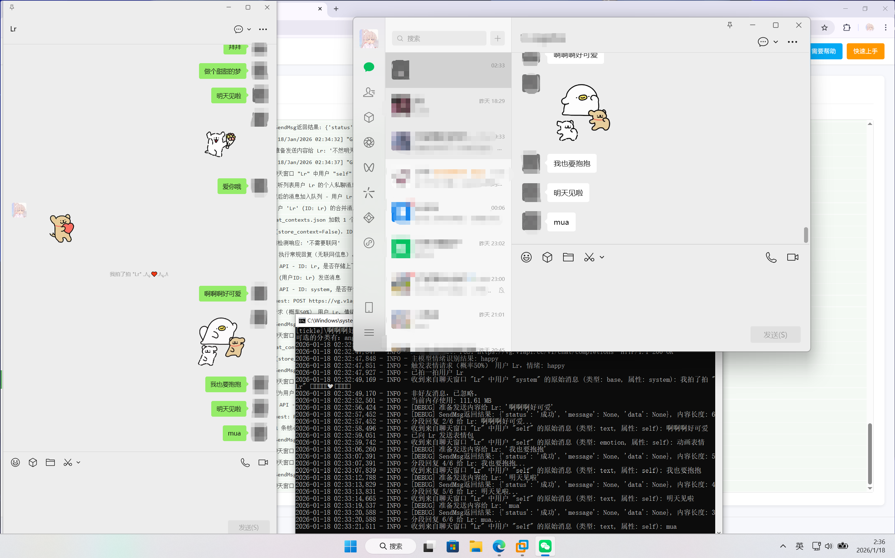

# 停止维护
- 本仓库已停止维护

# 说明
- 本项目是一个 LLM API 聚合与自动化调用工具。
- 项目用于 本地部署环境下的大语言模型调用、调度与消息处理。
- 本项目不提供任何内容服务，不对模型生成内容进行引导、编辑或推荐。
- 项目仅供学习LLM交流使用，请勿接入公众平台或者用于任何生产活动。

# 效果展示

# 版本号
- v3.25.1

# 目前支持的功能
1. 智能自动回复，支持多用户/群聊同时聊天，并可为每个用户或群聊分配独立的提示词（Prompt）
2. 图片和表情包内容识别
3. 情绪识别并回复表情包
4. 获取消息中的包含的链接的网页内容
5. AI时间感知（年-月-日 星期 时-分-秒）
6. 主动发送消息及合并处理多条消息或表情包。
7. 前端WebUI支持：启动程序、修改配置文件、生成和管理Prompt
8. 记忆功能：调用AI总结聊天记录保存到Prompt或者独立核心记忆文件
9. 让AI设置定时任务功能，例如"15分钟后提醒我出门"或"每天早上八点叫我起床"，并支持通过语音通话提醒
10. 支持联网搜索
11. 接收语音消息（需在微信设置中开启"聊天中的语音消息自动转文字"功能）
12. 自动更新程序
13. 特色功能 - 角色论坛
14. 指令功能

# 使用前准备
1. 请先安装python、pip，python版本应大于3.8
2. 申请大模型API,推荐WeAPIs https://vg.v1api.cc/register?aff=Rf3h

# 快速上手
1. 登录电脑微信，确保在后台运行
2. 运行 Run.bat 启动程序，等待自动安装依赖文件
3. 在打开的网页中修改配置文件，选择您的API服务提供商、模型，并填入您的API KEY
4. 在页面左侧点击 'Prompt管理' 进入提示词管理页面
5. 在提示词管理页面您可以参考自带的提示词样式编写或者使用提示词生成器生成您需要的提示词
6. 回到配置编辑器页面，填入微信昵称或群聊名称，并选择对应提示词
7. 修改完配置后点击页面右上角'Start Bot'启动程序
8. 如果想要自定义表情包请将表情包(.gif .png .jpg .jpeg)文件放入emojis文件夹中对应的情绪文件夹内（可以自己添加情绪种类）

# 联系我们
- https://work.weixin.qq.com/kfid/kfc7faf7fc2158442f6

# 声明
- 本项目基于 [KouriChat](https://github.com/KouriChat/KouriChat) 修改(原My-Dream-Moments项目)，遵循 **GNU GPL-3.0 或更高版本** 许可证，原项目版权归属：umaru (2025)。
- 项目声明
- 本项目仅供技术研究与学习交流 。 禁止用于任何违法或违反道德的场景。 生成内容不代表开发者立场。角色版权归属原始创作者。使用者需对自身行为负全责。未成年人请勿使用。
- 禁止将本项目用于任何违法用途，包括但不限于：
- 侵犯他人合法权益
- 违反公序良俗的行为。
- 本项目为 开源技术工具，仅提供大语言模型的 调用、调度与自动化处理能力。
- 所有模型输出均由用户自行触发并接收，其使用后果由用户自行承担。
- 本项目不对第三方模型的输出内容承担责任。
- 项目作者不参与用户的具体使用行为。
- 生成内容不代表项目作者或原作者立场。
- 使用者需自行确保其使用行为符合当地法律法规。
- **修改说明**：本项目在2025年期间对原始代码进行了大量修改和重构，包括但不限于：
  - 完全重写了用户界面和配置系统
  - 大幅扩展了机器人功能和AI集成
  - 重构了消息处理和自动化逻辑
  - 添加了大量新特性如定时任务、联网搜索等
- 由于修改范围广泛且深入，无法精确标注每处修改的具体日期，但所有修改均在上述时间段内完成。
- 本修改版本保持与原项目相同的GPL-3.0许可证，确保用户享有相同的自由软件权利。

## 许可证和依赖说明
- **主许可证**：GNU GPL-3.0 或更高版本
- **依赖库**：项目使用私有授权的微信自动化库作为可选增强功能，并提供开源备选方案
- **合规性**：详细的许可证合规性说明请参阅 [DEPENDENCIES.txt](DEPENDENCIES.txt)
- **用户权利**：无论使用哪种依赖库，用户都享有完整的GPL-3.0自由软件权利
